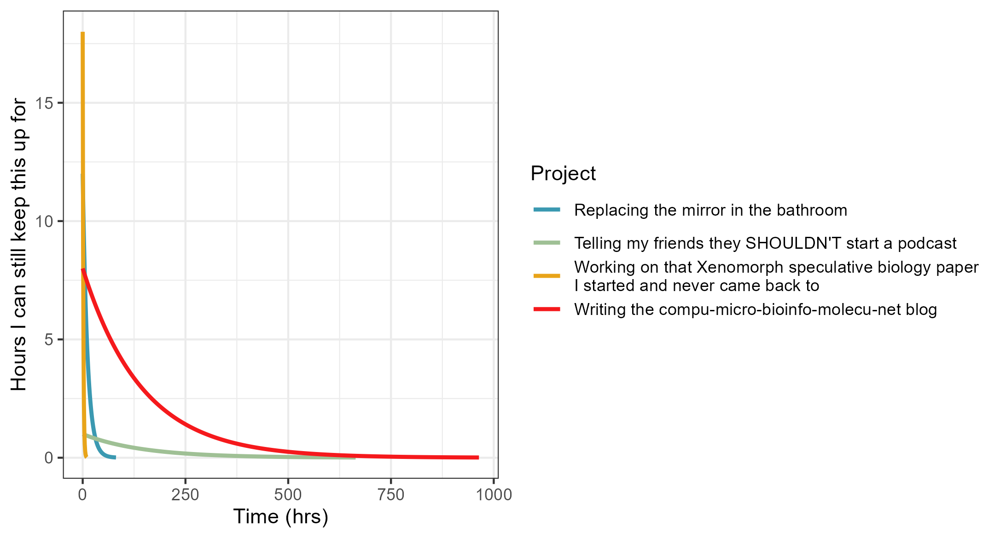

# Blog back end automation-ish

##### 2025-09-26

My usual relationship with extra-curricular projects has a half-life that’s measured in single afternoons rather than the desired weeks/months. As such, it was a bit of work figuring out the underlying tooling, workflow and architecture to make the blogging process sticky, yet frictionless as +possible. In other words, I wanted to maximise *sticktionlessness*. For me, that starts with automation.

<div style="text-align:center;">
  <figure style="display:inline-block; text-align:left;">
    
    <div style="height:6px;"></div>
    <figcaption style="display:block; margin-top:6px;">
      <em>Half-life decay in hours of various personal projects of mine. R code <a href="Resources/2025-09-26.Rmd">here</a></em>
    </figcaption>
  </figure>
</div>

</br>

## Setting up the workflow

Background: I set this up with git, hosted on GitHub. I run a combination of WSL2 on Windows 10, and Pop_OS! 22.04 for command line interface. Steps:

**1.** Decide on a post title and alter the `todays_title` variable, then run the following chunk in terminal:

``` bash
# Decide on title
todays_title=Blog_back_end_automation-ish

# Go to blog directory
cd compu-micro-bioinfo-molecu-net

# Grab today's date
todays_date=$(date +"%F")

# Generate the title string
title_string=${todays_date}_${todays_title}

## Generate post framework

# Create directory for new post
mkdir -p Posts/${title_string}

# Replace underscores with spaces for the post header
post_title=$(echo "${todays_title}" | sed 's/_/ /g')

# Create markdown file as a draft with headings and date
echo -e "# ${post_title}\n\n##### ${todays_date}\n\n## References\n\n" \
  > Posts/${title_string}/${title_string}_draft.md
```

</br>

**2.** Then I have to actually write the post.

- I write in [VSCode](https://code.%20visualstudio.com/) v1.104.1 (1), with the incredibly helpful [Markdown Preview Enhanced](https://github.com/shd101wyy/vscode-markdown-preview-enhanced) v0.8.19 (2). to see the mature markdown in real-time:
- Citations are managed with [Zotero](https://www.zotero.org/) v7.0.15 (3) with the [Better Bibtex for Zotero](https://github.com/retorquere/zotero-better-bibtex/releases/tag/v7.0.50) v7.0.50 plugin (4). The VSCode plugin [VSCode Zotero](https://marketplace.visualstudio.com/items?itemName=jinvim.vscode-zotero) v1.1.1 (5) is used to handle in-text citations and generation of the `references.bib`.

<div style="text-align:center;">
  <figure style="display:inline-block; text-align:left;">
    
    <div style="height:6px;"></div>
    <figcaption style="display:block; margin-top:6px;">
      <em>VSCode with Markdown Preview Enhanced viewing the .md file from Step 1.</em>
    </figcaption>
  </figure>
</div>

</br>

**3.** After painstakinly crafting a blog of the highest calibre - just perfect, [perfect in every way](https://youtu.be/nyoxtceA4Rg?si=HVRiwXofCxA5RRnF&t=188) - so perfect that it could reverse itself out from beyond a cosmic event horizon, I run pandoc v3.8 (6) using a modified [Vancouver.csl](../../Resources/Vancouver_modified.csl) file to neatly generate the bibliography in markdown format:

``` bash
# Installed pandoc
mamba create -y -n blog
mamba install -y -n blog conda-forge::pandoc

# Add bibliography with pandoc and generate the final post
mamba activate blog
pandoc \
  --from=markdown \
  --to=gfm \
  --citeproc \
  --bibliography=references.bib \
  --csl=Resources/Vancouver_modified.csl \
  --wrap=none \
  -o Posts/${title_string}/${title_string}.md \
  Posts/${title_string}/${title_string}_draft.md
```

**4.** If everything looks good, the draft is moved out of the repo and it’s perfect imperfections are hurried away from potential readers eyes. The repo is then prepped for `git push` and the blog post goes live:

``` bash
# Move the draft out of the repo
mv Posts/${title_string}/${title_string}_draft.md ../Drafts

# Create simlink called README.md so GitHub shows it as a main file, so I can keep the original file name - best of both worlds
ln -s ${title_string}.md Posts/${title_string}/README.md

# Move references file generated by VSCode Zotero in the root directory into the posts' Resource directory
mv references.bib Posts/${title_string}/Resources

# Add everything to repo
git add .

# Commit changes
git commit -m "Post: ${title_string}"

# Push to main
git push origin main
```

**5.** The post is now live:

<div style="text-align:center;">
  <figure style="display:inline-block; text-align:left;">
    
    <div style="height:6px;"></div>
    <figcaption style="display:block; margin-top:6px;">
      <em>Live post viewed on GitHub.</em>
    </figcaption>
  </figure>
</div>

</br>

While I don’t *love* coding, I am obsessed what it allows me to do: less overall work. So, is this process overengineered? Probably. Was it worth the challenge to set this up and have systems in place? Yes. Always yes. Anything to maximise *sticktionlessness*.


</br>

## Supplemental methods

Data and project half-life figure generated using R v4.4.2 (7), RStudio v2024.12.1 (8), rstudioapi v0.17.1 (9), tidyverse v2.0.0 (10) and colorspace v2.1-1 (11).

</br>

## References

<div id="refs" class="references csl-bib-body" entry-spacing="0">

<div id="ref-VisualStudioCode" class="csl-entry">

<span class="csl-left-margin">**1**. </span><span class="csl-right-inline">Visual Studio Code - Code Editing. Redefined. <https://code.visualstudio.com/></span>

</div>

<div id="ref-wangShd101wyyVscodemarkdownpreviewenhanced2025" class="csl-entry">

<span class="csl-left-margin">**2**. </span><span class="csl-right-inline">Wang Y. Vscode-markdown-preview-enhanced. 2025. <https://github.com/shd101wyy/vscode-markdown-preview-enhanced></span>

</div>

<div id="ref-takatsZotero2025" class="csl-entry">

<span class="csl-left-margin">**3**. </span><span class="csl-right-inline">Takats S, Stillman D, Cheslack-Postava F, Bagdonas M, Jellinek M, Najdek T, et al. Zotero. 2025. <https://www.zotero.org/></span>

</div>

<div id="ref-ZoterobetterbibtexMakeZotero" class="csl-entry">

<span class="csl-left-margin">**4**. </span><span class="csl-right-inline">Zotero-better-bibtex: Make Zotero effective for us LaTeX holdouts. <https://github.com/retorquere/zotero-better-bibtex></span>

</div>

<div id="ref-leeJinvimVscodezotero2025" class="csl-entry">

<span class="csl-left-margin">**5**. </span><span class="csl-right-inline">Lee S. Vscode-zotero. 2025. <https://github.com/jinvim/vscode-zotero></span>

</div>

<div id="ref-JgmPandocUniversal" class="csl-entry">

<span class="csl-left-margin">**6**. </span><span class="csl-right-inline">MacFarlane J. Pandoc: Universal markup converter. 2022. <https://github.com/jgm/pandoc></span>

</div>

<div id="ref-rcoreteamLanguageEnvironmentStatistical2024" class="csl-entry">

<span class="csl-left-margin">**7**. </span><span class="csl-right-inline">Team RC. R: A Language and Environment for Statistical Computing. 2024. <https://www.R-project.org/></span>

</div>

<div id="ref-positteamRStudioIntegratedDevelopment2025" class="csl-entry">

<span class="csl-left-margin">**8**. </span><span class="csl-right-inline">Posit-team. RStudio: Integrated Development Environment for R. 2025. <http://www.posit.co/></span>

</div>

<div id="ref-usheyRstudioapiSafelyAccess2022" class="csl-entry">

<span class="csl-left-margin">**9**. </span><span class="csl-right-inline">Ushey K, Allaire J, Wickham H, Ritchie G. Rstudioapi: Safely Access the RStudio API. 2022. <https://rstudio.github.io/rstudioapi/></span>

</div>

<div id="ref-wickhamWelcomeTidyverse2019" class="csl-entry">

<span class="csl-left-margin">**10**. </span><span class="csl-right-inline">Wickham H, Averick M, Bryan J, Chang W, McGowan LD, François R, et al. Welcome to the Tidyverse. Journal of Open Source Software. 2019 Nov 21; <https://joss.theoj.org/papers/10.21105/joss.01686></span>

</div>

<div id="ref-zeileisColorspaceToolboxManipulating2020" class="csl-entry">

<span class="csl-left-margin">**11**. </span><span class="csl-right-inline">Zeileis A, Fisher JC, Hornik K, Ihaka R, McWhite CD, Murrell P, et al. Colorspace: A Toolbox for Manipulating and Assessing Colors and Palettes. Journal of Statistical Software. 2020 Nov 29; <https://doi.org/10.18637/jss.v096.i01></span>

</div>

</div>
