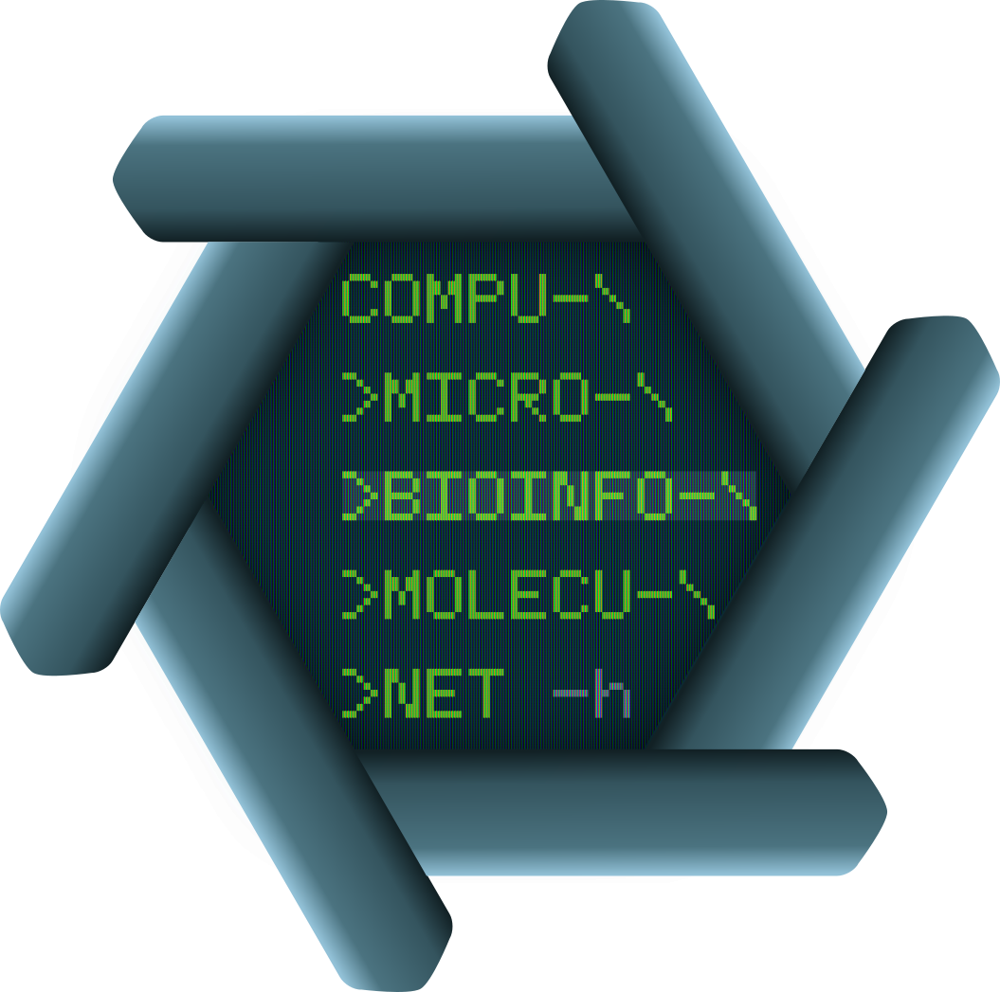

# compu-micro-bioinfo-molecu-net

## A blog by Ben Vezina.

- **Scope:** bioinformatics, microbiology, molecular biology, papers and other science-related things.
- **Content:** Thoughts, code, tutorials, resources.
 

**Check out the posts [here](https://github.com/bananabenana/compu-micro-bioinfo-molecu-net/tree/main/Posts)**

  
    <figcaption><em>The extremly high-value and sought-after logo for compu-micro-bioinfo-molecu-net</em></figcaption>

## About me
I work as a research scientist in microbiology and infectious diseases. I am an expert in molecular biology (my first love), microbiology and comptuational biology/bioinformatics (my main love). I've spent a lot of time looking at bacterial pathogens and how they transmit, along with their evolution, metabolism and resistance. My main focus is developing strategies to prevent and limit the spread of antimicrobial resistance through vaccine design, novel antimicrobial discovery, gene technologies and genomic surveillance.

I currently work as a postdoc at the [Department of Infectious Diseases](https://www.monash.edu/medicine/translational/infectious-diseases), Monash University *(2020-Current)*.

### Academic cred
If you want to check out my academic work and contributions to science:
- [Google Scholar](https://scholar.google.com.au/citations?user=Rf9oh94AAAAJ&hl=en&oi=ao)
- [OpenAlex](https://openalex.org/authors/a5051696322)
- [ORCiD](https://orcid.org/0000-0003-4224-2537)
- [GitHub](https://github.com/bananabenana)

### Previous gigs
- Consulting for the agricultral biotechnology sector *(2020-Current)*
- Postdoc at the [Griffith Institute for Drug Discovery](https://www.griffith.edu.au/institute-drug-discovery) *(2019-2020)*
- PhD from Monash University *(2014-2018)*
    - [Australian Centre for Disease Preparedness](https://www.csiro.au/en/about/facilities-collections/acdp), CSIRO
    - [Department of Microbiology](https://www.monash.edu/discovery-institute/departments/microbiology), Monash University
    - [School of Science](https://www.rmit.edu.au/about/schools-colleges/science), RMIT University
- Honours from Deakin University *(2013-2014)*
    - [Australian Centre for Disease Preparedness](https://www.csiro.au/en/about/facilities-collections/acdp), CSIRO
    - [School of Medicine](https://www.deakin.edu.au/faculty-of-health/school-of-medicine), Deakin University
- [One-pager resume](Resources/Resume_single_page_public_2025-09-24.pdf) for other

# Reader info
If for some reason you feel the urge to respond to one of these posts, just leave an [issue](https://github.com/bananabenana/compu-micro-bioinfo-molecu-net/issues).

# Inspo
This blog was inspired by the blogs of several peers that I enjoy reading. The blog title is inspired by the Marge Simpson-suggested [Compu-Global-Hyper-Mega-Net](https://simpsonswiki.com/wiki/Compu-Global-Hyper-Mega-Net), because *what am I gonna call my [blog]? All the good names are taken.*

    
  <figcaption><em>Credit: The Simpsons (and whoever owns them now)</em></figcaption>

# Licensing info
This blog in it's entirety, including all images, figures and text are licensed under CC BY, so feel free to use, manipulate, just chuck me a reference. Third-party images remain the property of their copyright holders and will be attributed when used.

  

# Meme-tier disclaimer
This blog is not affiliated with any of my current or past employers, nor does it represent their views etc. I'm not even sure it represents my views. Let's find out together.
